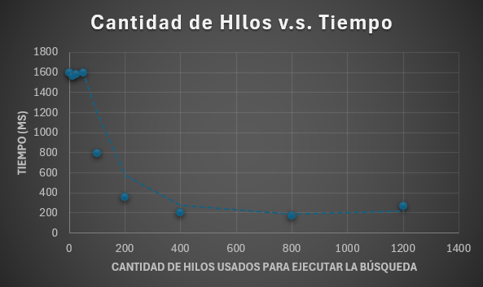

# Laboratorio 1 - ARSW
### Autor: Sebastian Galvis Briceño
## Introducción:
Este ejercicio contiene una introducción a la programación con hilos en Java, además de la aplicación a un caso concreto.

## Parte I - Introducción a Hilos en Java
1. De acuerdo con lo revisado en las lecturas, complete las clases CountThread, para que las mismas definan el ciclo de vida de un hilo que imprima por pantalla los números entre A y B.

   **Desarrollo:** Para crear un hilo que imprima por pantalla dos números recibidos entre A y B, lo hacemos de la forma:

   ```java
   public class CountThread implements Runnable{
    private int startNumber;
    private int endNumber;

    public CountThread(int startNumber, int endNumber) {
        this.startNumber = startNumber;
        this.endNumber = endNumber;
    }

    @Override
    public void run() {
        for(int i = startNumber; i <= endNumber; i++){
            System.out.println(i);
        }
    }
   }
   ```


2. Complete el método main de la clase CountMainThreads para que:
   - Cree 3 hilos de tipo CountThread, asignándole al primero el intervalo [0..99], al segundo [99..199], y al tercero [200..299].
   - Inicie los tres hilos con 'start()'.
   - Ejecute y revise la salida por pantalla.
   - Cambie el incio con 'start()' por 'run()'. Cómo cambia la salida?, por qué?.
   
   **Desarrollo:** Empezamos por intentar efectuar el procedimiento como se indica al inicio:
   ```java
   public class CountThreadsMain {

      public static void main(String a[]){
         CountThread t1 = new CountThread(0, 99);
         CountThread t2 = new CountThread(99, 199);
         CountThread t3 = new CountThread(200, 299);
         Thread thread1 = new Thread(t1);
         Thread thread2 = new Thread(t2);
         Thread thread3 = new Thread(t3);
         thread1.start();
         thread2.start();
         thread3.start();
      }

   }
   ```
   Al desarrollarlo de esta forma, vemos que los números se generaron con prioridades aleatorias en consola, quedando de esta forma, los números del 0 al 299 en desorden. Esto es debido a que todos los hilos se están ejecutando a la vez.
   
   Ahora, cambiaremos el método start() por run(), dejando el método main de la forma:
   ```java
   public static void main(String a[]){
        CountThread t1 = new CountThread(0, 99);
        CountThread t2 = new CountThread(99, 199);
        CountThread t3 = new CountThread(200, 299);
        Thread thread1 = new Thread(t1);
        Thread thread2 = new Thread(t2);
        Thread thread3 = new Thread(t3);
        thread1.run();
        thread2.run();
        thread3.run();
    }
   ```
   Y al ejecutarlo, podemos apreciar que, ahora sí, los números del 0 al 299 se imprimen en orden, pues únicamente estamos llamando al método run, ejecutando así todos los procesos en un solo hilo, en lugar de correr cada hilo por aparte.

## Parte II - Ejercicio Black List Search
Para un software de vigilancia automática de seguridad informática se está desarrollando un componente encargado de validar las direcciones IP en varios miles de listas negras (de host maliciosos) conocidas, y reportar aquellas que existan en al menos cinco de dichas listas.

Dicho componente está diseñado de acuerdo con el siguiente diagrama, donde:
* HostBlackListsDataSourceFacade es una clase que ofrece una 'fachada' para realizar consultas en cualquiera de las N listas negras registradas (método 'isInBlacklistServer'), y que permite también hacer un reporte a una base de datos local de cuando una dirección IP se considera peligrosa. Esta clase NO ES MODIFICABLE, pero se sabe que es 'Thread-Safe'.
* HostBlackListsValidator es una clase que ofrece el método 'checkHost', el cual, a través de la clase 'HostBlackListDataSourceFacade', valida en cada una de las listas negras un host determinado. En dicho método está considerada la política de que al encontrarse un HOST en al menos cinco listas negras, el mismo será registrado como 'no confiable', o como 'confiable' en caso contrario. Adicionalmente, retornará la lista de los números de las 'listas negras' en donde se encontró registrado el HOST.

  Al usarse el módulo, la evidencia de que se hizo el registro como 'confiable' o 'no confiable' se dá por lo mensajes de LOGs:
* INFO: HOST 205.24.34.55 Reported as trustworthy 
* INFO: HOST 205.24.34.55 Reported as NOT trustworthy

Al programa de prueba provisto (Main), le toma sólo algunos segundos análizar y reportar la dirección provista (200.24.34.55), ya que la misma está registrada más de cinco veces en los primeros servidores, por lo que no requiere recorrerlos todos. Sin embargo, hacer la búsqueda en casos donde NO hay reportes, o donde los mismos están dispersos en las miles de listas negras, toma bastante tiempo. 

Éste, como cualquier método de búsqueda, puede verse como un problema vergonzosamente paralelo, ya que no existen dependencias entre una partición del problema y otra. 

Para 'refactorizar' este código, y hacer que explote la capacidad multi-núcleo de la CPU del equipo, realice lo siguiente:
1. Cree una clase de tipo Thread que represente el ciclo de vida de un hilo que haga la búsqueda de un segmento del conjunto de servidores disponibles. Agregue a dicha clase un método que permita 'preguntarle' a las instancias del mismo (los hilos) cuantas ocurrencias de servidores maliciosos ha encontrado o encontró

   **Desarrollo:** La solución propuesta para este punto sería la siguiente:
   ``` java
   package edu.eci.arsw.spamkeywordsdatasource;
   
   import java.util.ArrayList;
   import java.util.List;
   
   /**
   *
   * @author sebastianGalvis
   */
   public class BlackListSearcher extends Thread /*Usaremos la herencia en lugar de la implementación de la interfaz, pues así lo solicita el ejercicio*/{
      private int from; /*El punto inicial del segmento asignado al hilo*/
      private int to; /*El punto final del semgneto asignado al hilo*/
      private String ip;
      private List<Integer> resultsIndexes; /*Vamos a ir guardando los índices de aquellas blacklist que reportaron la ip*/
      private int count;
   
      public BlackListSearcher(int from, int to, String ip) {
         this.from = from;
         this.to = to;
         this.ip = ip;
         this.count = 0;
         this.resultsIndexes = new ArrayList<Integer>();
      }
   
      @Override
      public void run() {
         HostBlacklistsDataSourceFacade skds = HostBlacklistsDataSourceFacade.getInstance(); /* Por la forma en que se usa en Main, podemos interpretar que es un singleton que podemos consultar en cualquier momento */
         for(int i = from; i < to; i++) /*Los cortes que se le asignarán a cada hilo*/ {
            if(skds.isInBlackListServer(i, ip)){
            resultsIndexes.add(i);
            }
            count++;
         }
      
      }
   
      public List<Integer> getResultsIndexes() {
         return resultsIndexes; /*Como lo pide el enunciado*/
      }
      
      public int getCount() {
         return count;
      }
   
   }
   ```
      Entendiendo que *HostBlacklistsDataSourceFacade* es un singleton que podemos consultar en cualquier momento por cualquier clase, y entendiendo la clase *BlackListSearcher* como un hilo que realiza la búsqueda en su segmento correspondiente, siendo posible consultar sus resultados acumulados en cualquier momento.


2. Agregue al método 'checkHost' un parámetro entero N, correspondiente al número de hilos entre los que se va a realizar la búsqueda (recuerde tener en cuenta si N es par o impar!). Modifique el código de este método para que divida el espacio de búsqueda entre las N partes indicadas, y paralelice la búsqueda a través de N hilos. Haga que dicha función espere hasta que los N hilos terminen de resolver su respectivo sub-problema, agregue las ocurrencias encontradas por cada hilo a la lista que retorna el método, y entonces calcule (sumando el total de ocurrencuas encontradas por cada hilo) si el número de ocurrencias es mayor o igual a BLACK_LIST_ALARM_COUNT. Si se da este caso, al final se DEBE reportar el host como confiable o no confiable, y mostrar el listado con los números de las listas negras respectivas. Para lograr este comportamiento de 'espera' revise el método join del API de concurrencia de Java. Tenga también en cuenta:
   
   * Dentro del método checkHost Se debe mantener el LOG que informa, antes de retornar el resultado, el número de listas negras revisadas VS. el número de listas negras total (línea 60). Se debe garantizar que dicha información sea verídica bajo el nuevo esquema de procesamiento en paralelo planteado. 
   * Se sabe que el HOST 202.24.34.55 está reportado en listas negras de una forma más dispersa, y que el host 212.24.24.55 NO está en ninguna lista negra.

   **Desarrollo:** De acuerdo a *stackovercoder.es*, todo problema vergonzosamente paralelo se divide en 3 fases:
   1. Leer datos de entrada.
   2. Ejecutar los cálculos necesarios sobre la entrada.
   3. Escribir los resultados de los cálculos.
   
   La parte 2 se puede ejecutar en varios núcleos, ya que cada cálculo es independiente; el orden de procesamiento no importa. Dividiendo así el trabajo sin la necesidad de comunicar los núcelos entre sí.
   
   Sabemos que tenemos tantos servidores como *skds.getRegisteredServersCount()* (Que tomaremos como L). Para dividir _skds_ en diferentes segmentos, cada hilo debe de contar con un indice inicial y uno final.

   La longitud promedio de cada segmento sería L // N (división entera).
   
   Puede que sobre un residuo (L % N), que significa que no todos los segmentos pueden tener exactamente el mismo tamaño.
   
   Para repartirlo lo más justo posible, se asigna un elemento extra a los primeros residuo segmentos.
   ```java
   private static List<int[]> divideSegments(int L /*Longitud total*/, int N/*Cantidad de hilos*/) {
        List<int[]> indexes = new ArrayList<>();

        int base = L / N;
        int rest = L % N;

        int start = 0;
        for (int i = 0; i < N; i++) {
            int len = base + (i < rest ? 1 : 0);
            int end = start + len;
            indexes.add(new int[]{start, end});
            start = end;
        }
        return indexes;
   }
   ```
   
   Al llamar al método checkHost(), se indicará cuántos hilos se desean usar.
   
   Teniendo esta herramienta, poner N hilos a trabajar es la parte más sencilla del trabajo, pues lo hacemos de la forma:
   ``` java
   HostBlacklistsDataSourceFacade skds=HostBlacklistsDataSourceFacade.getInstance();

   List<int[]> indexes = divideSegments(skds.getRegisteredServersCount(), threads); /*Obtenemos índices*/
   ArrayList<BlackListSearcher> searchers = new ArrayList(); /*Creamos la lista con 0 hilos*/
   for (int[] pair : indexes) {
      BlackListSearcher localThread = new BlackListSearcher(pair[0], pair[1], ipaddress);
      localThread.start();
      searchers.add(localThread); /*Agregamos un hilo por cada segmento solicitado*/
   }
   /*Hasta este punto ya tenemos N hilos trabajando en la búsqueda*/
   ```
   
   Teniendo esto, ahora solo tenemos que recolectar los resultados de cada hilo y hacer el reporte, dejando el método de la forma:
   ``` java
   public List<Integer> checkHost(String ipaddress, int threads){

        LinkedList<Integer> blackListOcurrences=new LinkedList<>();

        HostBlacklistsDataSourceFacade skds=HostBlacklistsDataSourceFacade.getInstance();

        List<int[]> indexes = divideSegments(skds.getRegisteredServersCount(), threads); /*Obtenemos índices*/
        ArrayList<BlackListSearcher> searchers = new ArrayList(); /*Creamos la lista con 0 hilos*/
        for (int[] pair : indexes) {
            BlackListSearcher localThread = new BlackListSearcher(pair[0], pair[1], ipaddress);
            localThread.start();
            searchers.add(localThread); /*Agregamos un hilo por cada segmento solicitado*/
        }
        /*Hasta este punto ya tenemos N hilos trabajando en la búsqueda*/

        for (BlackListSearcher s : searchers) {
            try {
                s.join();
            } catch (InterruptedException e) {
                Thread.currentThread().interrupt();
            }
        } /*Esperamos a que todos terminen*/

        int ocurrencesCount = 0;
        int checkedListsCount = 0;

        for (BlackListSearcher s : searchers) {
            blackListOcurrences.addAll(s.getResultsIndexes());
            ocurrencesCount += s.getResultsIndexes().size();
            checkedListsCount += s.getCount();
        } /*Recolectamos los resultados de cada hilo*/

        if (ocurrencesCount >= BLACK_LIST_ALARM_COUNT) {
            skds.reportAsNotTrustworthy(ipaddress);
        } else {
            skds.reportAsTrustworthy(ipaddress);
        } /*Reportamos según la regla*/

        LOG.log(Level.INFO, "Checked Black Lists:{0} of {1}",
                new Object[]{checkedListsCount, skds.getRegisteredServersCount()});

        return blackListOcurrences;
   }
   ```
   De esta forma quedaría completamente implementada una solución que busca en todas las blacklists. Y daríamos por finalizado el ejercicio.


   Sin embargo, personalmente, aún continúa una inquietud, lógicamente a mayor cantidad de hilos en la tarea, más rápido recorreremos todas las blacklist. Sin embargo, un ejercicio interesante sería encontrar una forma interesante de comunicar los hilos, de tal forma que puedan detener la búsqueda al completar en total las 5 ocurrencias entre todos.

   Tras realizar una búsqueda, encontré información sobre los contadores compartidos, haremos uso de la clase AtomicInteger para realizar la prueba:
   
   **Clase BlackListSearcher:**
   ```java
      package edu.eci.arsw.spamkeywordsdatasource;
      
      import java.util.ArrayList;
      import java.util.List;
      import java.util.concurrent.atomic.AtomicInteger;
      
      /**
       *
       * @author sebastianGalvis
       */
      public class BlackListSearcher extends Thread /*Usaremos la herencia en lugar de la implementación de la interfaz, pues así lo solicita el ejercicio*/{
         private int from; /*El punto inicial del segmento asignado al hilo*/
         private int to; /*El punto final del semgneto asignado al hilo*/
         private String ip;
         private List<Integer> resultsIndexes; /*Vamos a ir guardando los índices de aquellas blacklist que reportaron la ip*/
         private int count;
         private int limit;
         private AtomicInteger globalOccurrences;/*Referencia compartida*/
      
         /*Modificamos el hilo para que conozca la cantidad máxima de ocurrencias permitida y para que tenga el contador compartido*/
         public BlackListSearcher(int from, int to, String ip, int limit, AtomicInteger globalOccurrences) {
            this.from = from;
            this.to = to;
            this.ip = ip;
            this.count = 0;
            this.resultsIndexes = new ArrayList<Integer>();
            this.limit = limit;
            this.globalOccurrences = globalOccurrences;
         }
      
         @Override
         public void run() {
            HostBlacklistsDataSourceFacade skds = HostBlacklistsDataSourceFacade.getInstance(); /* Por la forma en que se usa en Main, podemos interpretar que es un singleton que podemos consultar en cualquier momento */
            for (int i = from; i < to; i++) {
               /*Si el límite ya fue alcanzado entre todos los hilos, se detienen*/
               if (globalOccurrences.get() >= limit) break;
      
               count++;
               if (skds.isInBlackListServer(i, ip)) {
                  resultsIndexes.add(i);
                  globalOccurrences.incrementAndGet(); /*Aumenta el contador compartido*/
               }
            }
      
         }
      
         public List<Integer> getResultsIndexes() {
            return resultsIndexes; /*Como lo pide el enunciado*/
         }
      
         public int getCount() {
            return count;
         }
      
      }
   ```
   
   **Método CheckHost:**
   ``` java
   public List<Integer> checkHost(String ipaddress, int threads){

        LinkedList<Integer> blackListOcurrences=new LinkedList<>();

        HostBlacklistsDataSourceFacade skds=HostBlacklistsDataSourceFacade.getInstance();

        AtomicInteger globalOccurrences = new AtomicInteger(0); /*Inicializamos el contador atómico*/

        List<int[]> indexes = divideSegments(skds.getRegisteredServersCount(), threads); /*Obtenemos índices*/
        ArrayList<BlackListSearcher> searchers = new ArrayList(); /*Creamos la lista con 0 hilos*/
        for (int[] pair : indexes) {
            BlackListSearcher localThread = new BlackListSearcher(pair[0], pair[1], ipaddress, BLACK_LIST_ALARM_COUNT, globalOccurrences);
            localThread.start();
            searchers.add(localThread); /*Agregamos un hilo por cada segmento solicitado*/
        }
        /*Hasta este punto ya tenemos N hilos trabajando en la búsqueda*/

        for (BlackListSearcher s : searchers) {
            try {
                s.join();
            } catch (InterruptedException e) {
                Thread.currentThread().interrupt();
            }
        } /*Esperamos a que todos terminen*/

        int ocurrencesCount = 0;
        int checkedListsCount = 0;

        for (BlackListSearcher s : searchers) {
            blackListOcurrences.addAll(s.getResultsIndexes());
            ocurrencesCount += s.getResultsIndexes().size();
            checkedListsCount += s.getCount();
        } /*Recolectamos los resultados de cada hilo*/

        if (ocurrencesCount >= BLACK_LIST_ALARM_COUNT) {
            skds.reportAsNotTrustworthy(ipaddress);
        } else {
            skds.reportAsTrustworthy(ipaddress);
        } /*Reportamos según la regla*/

        LOG.log(Level.INFO, "Checked Black Lists:{0} of {1}",
                new Object[]{checkedListsCount, skds.getRegisteredServersCount()});

        return blackListOcurrences;
   }
   ```

De esta forma, hemos conseguido comunicar los hilos entre si, de tal forma que, si entre todos encuentran el máximo número de ocurrencias permitido antes de finalizar la búsqueda de sus propios segmentos, terminan la acción y envían la alerta.


## Parte II.I Para discutir la próxima clase (NO para implementar aún)
La estrategia de paralelismo antes implementada es ineficiente en ciertos casos, pues la búsqueda se sigue realizando aún cuando los N hilos (en su conjunto) ya hayan encontrado el número mínimo de ocurrencias requeridas para reportar al servidor como malicioso. Cómo se podría modificar la implementación para minimizar el número de consultas en estos casos?, qué elemento nuevo traería esto al problema?

**Respuesta:** Leí este punto después de haber trabajado en esta duda, aprendí sobre cómo compartir información entre hilos mediante, en este caso, contadores atómicos.


## Parte III - Evaluación de Desempeño
A partir de lo anterior, implemente la siguiente secuencia de experimentos para realizar las validación de direcciones IP dispersas (por ejemplo 202.24.34.55), tomando los tiempos de ejecución de los mismos (asegúrese de hacerlos en la misma máquina):
* Un solo hilo. 
* Tantos hilos como núcleos de procesamiento (haga que el programa determine esto haciendo uso del API Runtime). 
* Tantos hilos como el doble de núcleos de procesamiento. 
* 50 hilos. 
* 100 hilos.

Al iniciar el programa ejecute el monitor jVisualVM, y a medida que corran las pruebas, revise y anote el consumo de CPU y de memoria en cada caso.


Con lo anterior, y con los tiempos de ejecución dados, haga una gráfica de tiempo de solución vs. número de hilos. Analice y plantee hipótesis con su compañero para las siguientes preguntas (puede tener en cuenta lo reportado por jVisualVM):

Para empezar, vamos a usar la clase System para calcular los tiempos que tardan las ejecuciones, de la forma:
``` java
long start = System.currentTimeMillis();
/*Proceso a medir*/
long end = System.currentTimeMillis();
long duration = end - start;
```

De esta forma, y ya habiendo descargado jVisualVM, procederemos a efectuar las pruebas:
* Un solo hilo:
   - Tiempo de ejecución: 1593 ms

* Tantos hilos como núcleos de procesamiento:
   - Tiempo de ejecución: 1563 ms

* Tantos hilos como el doble de núcleos de procesamiento:
   - Tiempo de ejecución: 1583 ms

* 50 hilos:
   - Tiempo de ejecución: 1593 ms

* 100 hilos:
   - Tiempo de ejecución: 797 ms

* 200 hilos (experimento adicional):
   - Tiempo de ejecución: 354 ms

* 400 hilos (experimento adicional):
   - Tiempo de ejecución: 206 ms

* 800 hilos (experimento adicional):
   - Tiempo de ejecución: 175 ms

* 1200 hilos (experimento adicional):
   - Tiempo de ejecución: 271 ms

En base a los resultados obtenidos, graficamos el tiempo que toma efectuar la búsqueda de acuerdo a la cantidad de hilos:



Nota: Debido al corto tiempo de ejecución, VisualVM no alcanzó a registrar y mostrar consumos de CPU y memoria. De tal forma que se tuvo que omitir el registro de dichos resultados en el documento.

*Incluso, se intentó agregar un tiempo de sleep al final para darle más tiempo al programa, pero seguía sin registrarlo.*

## Parte IV - Ejercicio Black List Search

1. Según la ley de Amdahls:
   
   ,
   
   donde S(n) es el mejoramiento teórico del desempeño, P la fracción paralelizable del algoritmo, y n el número de hilos, a mayor n, mayor debería ser dicha mejora. Por qué el mejor desempeño no se logra con los 500 hilos?, cómo se compara este desempeño cuando se usan 200?.

2. Cómo se comporta la solución usando tantos hilos de procesamiento como núcleos comparado con el resultado de usar el doble de éste?.

Sabemos que 
* S(n): “Speedup” o mejoramiento del desempeño con n hilos,
  Representa cuántas veces es más rápido el programa al usar n hilos en comparación con usar 1 solo hilo.
* P: fracción paralelizable del algoritmo, que, en este caso, corresponde a la proporción del trabajo que sí se puede dividir entre hilos.
  En el problema tratado, eso es básicamente la búsqueda de la IP en los rangos de servidores de listas negras.
* n: número de hilos, exactamente el número de hilos que se decide usar en las pruebas.
* (1−P): fracción no paralelizable (serial), son las partes que no importa cuántos hilos se pongan, siempre hay que hacer de forma secuencial: inicialización, juntar los resultados, sincronización, etc.
  Esta fracción es la que explica por qué con 500 hilos no se acelera más, sino que incluso empeora por overhead (*costo adicional (tiempo, recursos, memoria, energía, etc.) que se necesita para realizar una tarea, aparte del trabajo útil que realmente queremos hacer*).

Al usar tantos hilos como núcleos obtenemos casi el mismo resultado que al usar el doble, debido a que en este tipo de trabajos usar un número de hilos igual al número de núcelos suele dar el mejor tiempo (o un timepo muy cercano al mejor).
Al usar el doble de hilos se entra en sobresuscripción *(tener más hilos activos que núcleos de CPU disponibles para ejecutarlos en paralelo)* y normalmente el tiempo no mejora e incluso empeora. 
* Cambios de contexto: con más hilos que núcleos, el Sistema Operativo rota hilos continuamente, lo que se traduce en tiempo perdido en vez de avanzar.
* Pérdida de caché: más hilos compitiendo, significa más “cache thrash”, lo que traduce más latencia de memoria.


Sin embargo, es interesante preguntarse por qué en nuestro caso, contrario a lo que se indica, obtuvimos mejores resultados cerca de los 800 hilos.
Tomándome el atrevimiento de teorizar, pensaría que esto se debe a que, al agregar la tarea de sincronización entre hilos que se supone que no se debía implementar todavía, la tarea pasó de sor sólo cálculo, a contar con tiemposd de espera.
* Cuando un hilo se queda esperando (por ejemplo, en la sincronización), el CPU puede usar otro hilo.
* Al tener muchos hilos, se aumentan las chances de que siempre haya algo listo para ejecutar, y no se quede el CPU ocioso.

Teniendo esto en cuenta, lo más probable es que:
* Los hilos no estaban consumiendo CPU todo el tiempo, sino bloqueados esperando respuestas.
* Al meter muchos hilos, mientras unos esperan, otros trabajan, lo que traduce en un CPU siempre ocupado.
* La JVM también optimiza la ejecución interna con sus scheduler pools *(agrupan tareas y las envían como trabajo a los hilos gestionados por el Sistema Operativo)*, que reparten mejor el trabajo con más hilos en la cola.


3. De acuerdo con lo anterior, si para este problema en lugar de 100 hilos en una sola CPU se pudiera usar 1 hilo en cada una de 100 máquinas hipotéticas, la ley de Amdahls se aplicaría mejor?. Si en lugar de esto se usaran c hilos en 100/c máquinas distribuidas (siendo c es el número de núcleos de dichas máquinas), se mejoraría?. Explique su respuesta.


Caso 1: 100 hilos en una sola CPU.
* Todos los hilos compiten por los mismos núcleos, lo que significa que habrá cambio de contexto (overhead).
* Aunque se tengan 100 hilos, si solo hay, por ejemplo, 8 núcleos, nunca se ejecutan 100 en paralelo, sino máximo 8 a la vez.

Caso 2: 1 hilo en cada una de 100 máquinas distintas
* Aquí sí se tendría paralelismo real, porque cada máquina aporta su propio CPU.
* La Ley de Amdahl se aplica de forma más favorable, ya que el trabajo paralelo realmente escala.
* El límite seguirá siendo la parte secuencial del algoritmo (la fracción no paralelizable), pero en este caso los 100 hilos estarían trabajando en paralelo sin competir.

Caso 3: Usar c hilos en 100/c máquinas (siendo c el número de núcleos por máquina)
* Esto sería lo óptimo en un escenario distribuido. 
* Cada máquina aprovecharía todos sus núcleos (ejecución paralela interna), y además se combinaría el trabajo de varias máquinas. 
* La eficiencia sería mayor que en el caso de 100 hilos en una sola máquina, porque se reducirían los cambios de contexto y se aprovecharían mejor los recursos.


